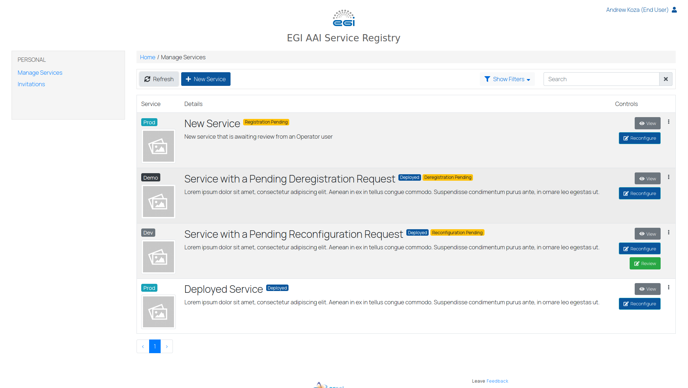
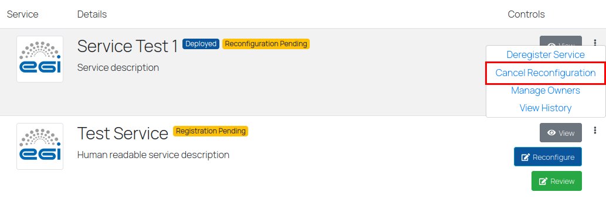
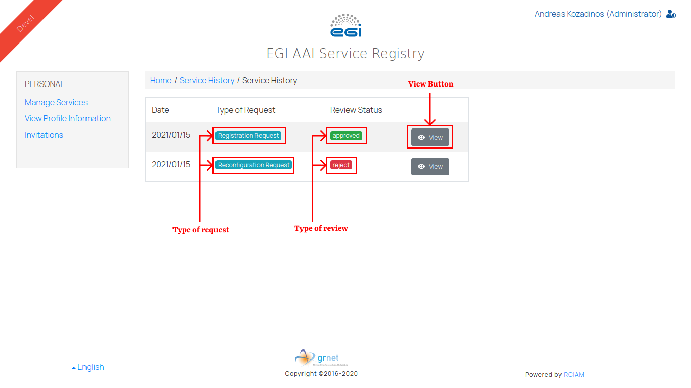
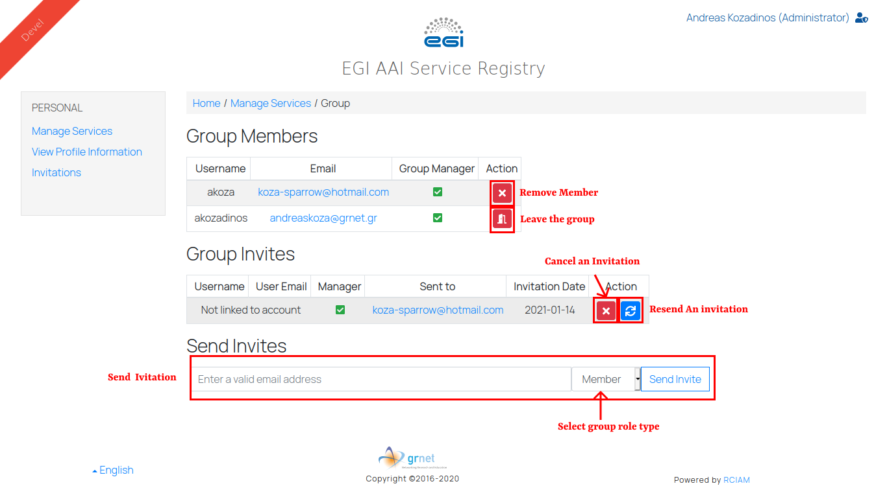
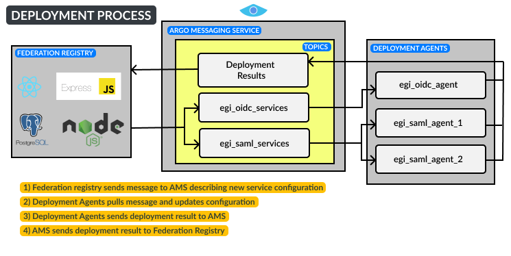

Federation Registry provides a secure web interface through which Service Owners
can register and manage their OpenID Connect and Saml based Services.

Users in this portal can view and also manage their Services through creating
and submitting Service Requests. There are three types of requests that can be
made: registration, reconfiguration and deregistration. Once a request is
submitted users with reviewing privileges are notified and can view and review
them. If a petition is approved then it is deployed to the requested integration
environment.

The following document will try to cover step by step all different
functionalities and use cases. Users of the application should to follow the
guidelines provided and submit feedback for any issues they encounter.

The instance used for testing can be found at the following URL
[https://http://aai.egi.eu/federation](https://http://aai.egi.eu/federation)

Send us feedback,report problems and bugs using the form by following the link
[https://forms.gle/rnAq7bBT4bN7WiNYA](https://forms.gle/rnAq7bBT4bN7WiNYA)

## Login and Authentication

To login to the platform use the login button to the top right. This will
redirect user to EGI check-in authentication proxy to select an identity
provider and login. After giving consent the user will be redirected back to the
Federation Registry portal.

Login Steps:

1. Go to the Landing Page and use the login button
1. Select an identity provider from the provided list
1. Give consent
1. User is redirected back to federation registry (indicated on the top right of
   the screen is the username and the role assigned to the user)

## Manage Services

Services can be managed by accessing the Manage Services page available in the
side menu on the left of the screen. In the Manage Services page a user can view
all the Services they own. Each Service is listed, the table as shown above.
Service owners can view basic information about Services they own such as the
service name, service description, the environment the service is integrated
(see [Integration Environments](#integration-environments)), it's current
deployment status (see [Deployment](#deployment)) and some of the available
actions for each Service.

Users can manage their services by creating service requests. A Service Request
can request either to register, reconfigure or deregister a service, users can
create edit and cancel Service Requests for services they own:

{}When a Service Request is submitted all
Service Operators are notified a new request was submitted and is pending their
review{}

### **Available Actions**

- [View Services](#view-service)
- [Register a Service](#create-a-registration-request)
- [Reconfigure a Service/Edit a Service Request](#create-a-reconfiguration-request-or-edit-an-open-request)
- [Deregister a Service](#create-a-deregistration-request)
- [Cancel an Open Service Request](#cancel-an-open-request)
- [Respond to Changes Requested to a Request](#changes-requested)
- [Manage Ownership of a Service](#manage-ownership-of-a-service)
- [View Service History](#view-service-history)
- [Review a Request (Only Development Environment)](#review-a-request-administrators-only)

### View Service

Viewing a service configuration is available from the the view button on a
service list item. The full service configuration is split between two tabs, the
General Tab and the Protocol Tab. The General tab contains information described
in the [General Information](./../sp/#general-information) section and the
Protocol Tab information differs depending on the service protocol. For SAML
services refer to the [Saml Service Provider](./../sp/#saml-service-provider)
section and for OIDC services to the
[OpenID Connect Service Provider](./../sp/#openid-connect-service-provider)
section for more details.

### Create a Registration Request

To create a new service a user must create a registration request by clicking
the new service button in the toolbar located in the manage services page. This
button redirects the user to a new page where he will have to fill out a form by
providing the following information.

- General information about the service (Service Name, Description) located in
  the first tab. More info on the
  [General Information](./../sp/#general-information) section
- And more specific technical information in the second tab concerning the
  protocol of the service SAML/OIDC. More info on the
  [Saml Service Provider](./../sp/#saml-service-provider) and the
  [OpenID Connect Service Provider](./../sp/#openid-connect-service-provider)
  sections respectively.

### Create a Reconfiguration Request or edit an Open Request

To create a reconfiguration request for a service or edit a pending request the
service must be at a Deployed state. To find a specific service in the service
list view users can use the filters or the search box provided in the Service
List page toolbar and then use the Reconfigure button to create a request or
edit a pending request for that service. The reconfiguration button will open a
new page containing the current state of the service or of the pending request.
User can edit any of the fields and submit the request.

### Create a Deregistration Request

To create a Deregistration Request for a Service, the service must be in a
Deployed state. To find it in the service list view the user can use the filters
or the search box provided in the Service List page toolbar and then click the
more options located in the top right corner of the service box and select the
Deregister Service option.

### Cancel Pending Request

Canceling a pending service request can either be done in the more options menu
or in the edit request page (accessed using the reconfiguration button when
there is a pending request) by using the cancel request option.

### Changes Requested

A reviewer can request changes to a submitted request and provide some feedback
describing changes that need to be made to the service configuration. Service
owners will get an email notification and should login to the platform and edit
their request. Services that have pending requests with requested changes can be
identified by the Changes Requested badge next to their name and from the red
exclamation mark on the Reconfiguration Button. When editing their request users
can view the comment left from the reviewer. Submitting the request will resolve
the changes requested by the reviewer and Service will once again be in the
pending review state.

### View Service History

After a service is registered a user can access all requests that have been
reviewed for that service in View History page which can be accessed through the
more options menu in the Service List page located in the top right corner of
each service box. All reviewed requests are listed in the History View in
chronological order starting from registration. User can view each snapshot
which contains the full configuration using the View Button.

### Review a Service Request

To find services with pending requests users can use the Pending Services
filter. When a service has a pending request the review button will be available
in the service box item. By using the Review Button users can view the requested
service configuration and submit a review using the expandable review menu. A
review can either:

- **Approve**: approving a request starts the deployment of the requested
  service configuration described in the reviewed request.
- **Reject**: if the reviewer decides that the requested is not valid he can
  reject it canceling the request.
- **Request Changes**: reviewer can propose changes to the pending request by
  leaving a comment describing the changes that have to be made.

{}The Review option will be available to
service owners only for Services integrated in the development instance of EGI
Check-in{}

## Integration Environments

Using Federation Registry users can register their SAML and OIDC services to
multiple instances of EGI Check-in

- **Development**: The development is used for testing a service configuration
  and service owners can review their own requests.
- **Demo**: The demo environment is used to test Production Ready Services.
  Petitions are reviewed only by Technical reviewers.
- **Production**: The production instance allows members of the EGI User
  Community to access your service. This requires that your service meets some
  additional requirements such as a valid Policy Url and compliance with the
  code of conduct of EGI. In addition request have to go through a double
  approval phase from technical reviewer and a policy reviewer.

## Manage Ownership of a Service

Services are owned by groups of users. Members of the group can be simple
members or group managers. All group members can view the service and also
create requests for that service. Group managers can also invite or remove
members to and from the group. When a user requests to register a service an
owners group is automatically created for that service, note that the creator of
this request is also a group manager.

To manage/view the owners group of a service we must locate target service in
the List View and select the Manage Services in the more options menu. Once in
the Manage Group page the user can:

- View group members
- Leave the group (a group must have at least one user and one group manager)
- Send an Invitation Link to an email address using the email invitation box
  (Only group managers)
- View pending invitations (Only group managers)
- Renew/Resend an Invitation (Only group managers)
- Remove Group Members (Only group managers)

## Invitations

To manage a service in Federation Registry and be able to create requests users
must be members of the owners group. When a user submits a registration request
they are automatically added to the owners group for that service and additional
users can also be added by sending invitations. Invitations are sent in the form
of an email containing an invitation link. The invitation link will lead the
user to federation registry and upon login the invitation will be activated and
linked to their account. All pending invitations will be displayed in the
invitations page, where the user can respond to each invitation by either
accepting it or declining it.

Users that have pending invitations will also be notified through a notification
alert at the top of the Manage Services page.

### Have you received an email invitation to manage a service through the Federation Registry?

Steps you need to take:

1. Follow the invitation link
1. Log in via Check-in (optional - this will not be necessary if you are already
   logged into the Federation Registry)
1. Accept the service owner role. As a group manager you should then be able to
   invite additional users for managing the service. Please refer to the
   documentation
   [Managing the Ownership of a Service](#manage-ownership-of-a-service) for
   more information.

## Outdated Services

### Why is my service flagged as outdated?

In some cases it might be necessary to make updates to the service configuration
in order to:

- Improve compliance with the technical and policy baseline of the
  infrastructure;
- Ensure the security and integrity of the service configuration;
- Comply with agreements with Peer Federations;
- Improve interoperability; All services registered in the Federation Registry
  should meet the technical and policy baseline. Each integration environment
  may have different specifications for the registered services. Services that
  have invalid values or are missing some required information in their
  configuration are flagged as outdated.

### What happens when my service is flagged as outdated?

If a service is flagged as outdated it continues to be functional and you will
get notified that you need to update the service configuration to follow the
technical and policy baseline. Notifications will be sent in a regular basis
until you submit a request to update the service configuration.

### How can I update a service flagged as outdated?

1. Connect to the Federation Registry at https://aai.egi.eu/federation using
   your Check-in identity you have registered as a service owner
2. Identify your outdated services using the "Show Outdated Filter" (Outdated
   Services can also be identified from the Outdated status badge and the red
   exclamation on the "Reconfigure" button)
3. Click the "Reconfigure" button to create a new request to reconfigure your
   service with the required information (Invalid fields will be highlighted and
   an error message will describe the issue)
4. Submit your request

## Deployment

Once a service request is approved changes have to be deployed on a remote
system. If it is a registration request a new service must be deployed, for a
reconfiguration request changes must be made to the deployed service and for a
deregistration request a deployed service must be deleted. Services are managed
by remote tools (MitreId, SSP, Keycloak) and when a request is approved
federation registry initiates a process to deploy the changes that have been
requested. This is an automated asynchronous process that uses the Argo
Messaging Service to communicate with these remote systems. Services that
undergo this process are under waiting deployment status and although they will
be displayed in service list view and can be viewed, users will be blocked from
creating service requests until the service is deployed. Reconfiguration
requests that don't change service attributes that are tracked by the remote
systems will be deployed immediately.

